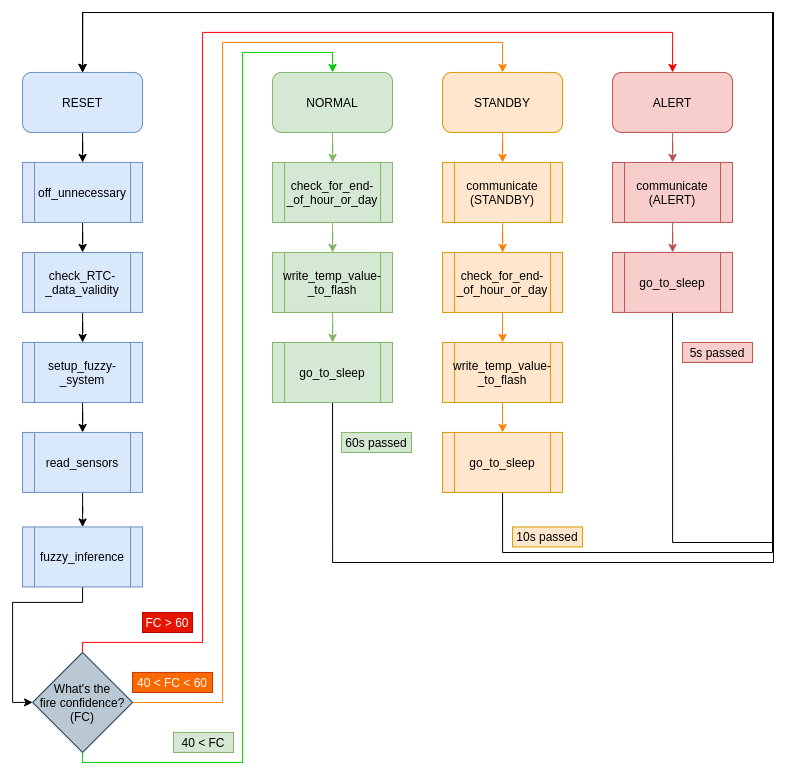

# Fuzzy_Fire_Detection

## Preview

This is an ULP (Ultra Low Power) IoT node created mainly for remote areas monitoring (hence the need for ULP capabilities, especially that an energy harvesting powering system is being concieved for it).

The initial goal was to focus on the end-node and create a strong yet ULP fire detection IoT node, then build our way up and configure it in a mesh network (not researched yet) or a star network where there's a master node that's always awake and all the rest slave nodes would be reporting to it. 

We wanted to create a real-time fire propagation tracking system that would help firefighters and land owners to be safe, be effecient in fighting the fire, and be fast to act.

Now as we finished the end node, we noticed that it could be a standalone fire detection IoT node that, with minimal configurations, could be employed anywhere. 

The implemented fuzzy system is studied and designed in this paper: https://doi.org/10.1016/j.adhoc.2011.06.008, I just understood the system and implemented it! **I claim no ownership over the actual design of the system, neither do I guarantee the effictiveness of my implemented solution**. 

We added a temperature logging functionality that provides a daily temperatue report based on an edge computing technique in order to save energy furthermore. The temperature data that's gathered during the day is parsed and turned into a per-hour based report where each day the **max**, **min**, and **mean** temperatures of each hour are computed and sent in the format: 

{H0:[mx=MAX_VALUE,mi=MIN_VALUE,mn=MEAN_VALUE],H1, .. ,H23:[mx=MAX_VALUE,mi=MIN_VALUE,mn=MEAN_VALUE]}

## Initial code structure

Changes are to be expected in the code (maybe additional functionalities, the already implemented ones are good to go), as well as some power testing, documentation, and demos/examples.
